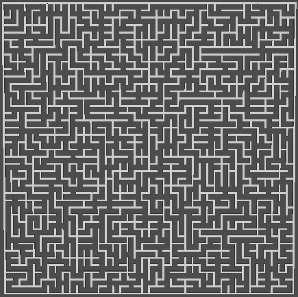

# Godot4b1-MazeGen-AB-gdscript
An implementation of the aldous broder algorithm in gdscript with Godot 4 beta 1

Part of a [series](https://github.com/randompast/Godot-maze-gen-migration-from-Unity-C-Sharp)

